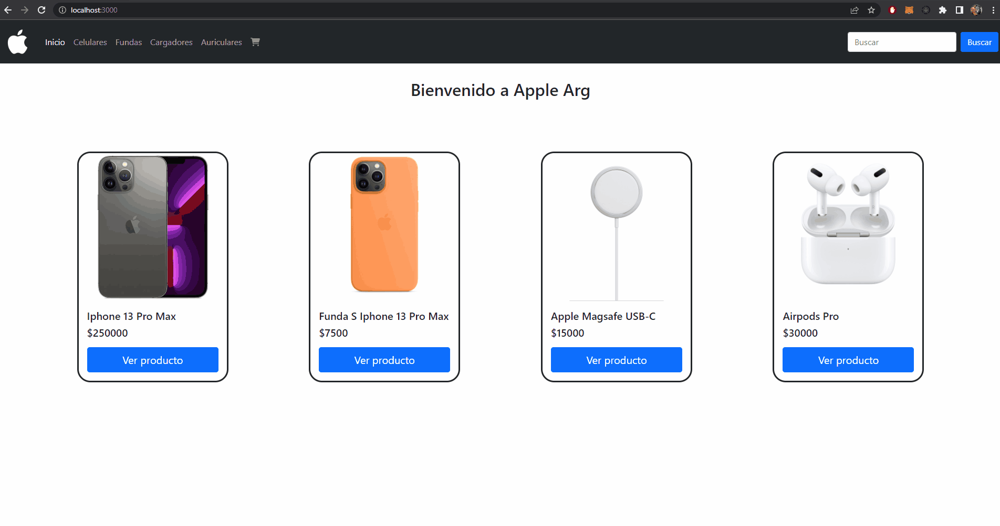

# Proyecto Final React JS - Coderhouse

## Apple Arg 

Apple Arg es un ecommerce de productos Apple, realizado para el proyecto final del curso de React JS.

## Demo

### Librerías externas

Se utilizaron componentes de React Bootstrap.
Se utilizo React Router Dom para el manejo de rutas y links en el sitio.
Se utilizaron estilos CSS para el diseño general del sitio.
Se utilizo React FontAwesome para agregar iconos.
Se utilizo la base de datos Firebase.

### Firebase

Se utilizo la version v9.6.11 de Firebase

### Deploy

### Proyecto realizado por Alvaro Cangaro para CODERHOUSE